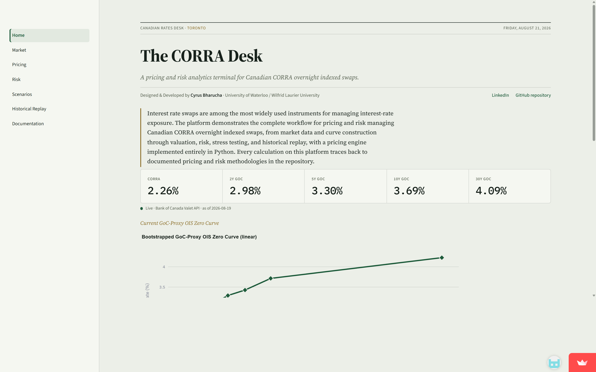
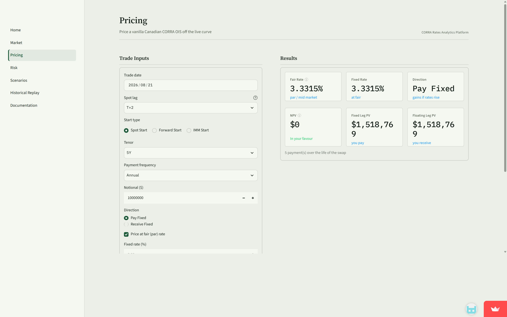
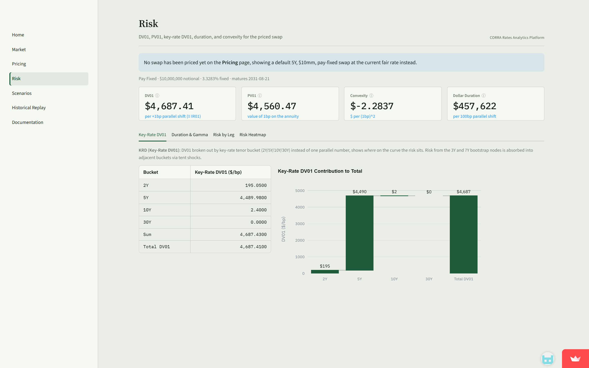

# CORRA Rates Analytics Platform

Pricing and risk analytics for Canadian **CORRA overnight indexed swaps (OIS)**, built in Python using public data. Curve bootstrap, swap valuation, DV01, key-rate duration, scenario shocks, and Monte Carlo are all written from scratch without QuantLib.

**Live demo:** https://corra-rates-analytics-platform-3ncvfa6f4pv2ytsc3pauy7.streamlit.app/ - a fully interactive deployment of this repository's pricing and risk stack, running live against the Bank of Canada API.

**Repository:** https://github.com/CyrusBharucha/corra-rates-analytics-platform



<table>
<tr>
<td></td>
<td></td>
</tr>
</table>

---

## What this is

An institutional-style rates-desk analytics tool for Canadian CORRA OIS, the interest rate swap that replaced CDOR-based swaps as Canada's benchmark since the 2021-2022 industry-wide LIBOR/CDOR transition.

**Live data.** Market data (CORRA fixings, Government of Canada benchmark bond yields) is pulled from the [Bank of Canada Valet API](https://www.bankofcanada.ca/valet/docs).

**Source-visible math.** The curve bootstrap, pricer, risk engine, and scenario engine are all written in Python with no external pricing libraries, so every output ties back to a specific formula in the code.

---

## Feature list

### Market data
- Live CORRA fixings and GoC benchmark bond yields (2Y/3Y/5Y/7Y/10Y/30Y) from the Bank of Canada Valet API
- Graceful handling of weekends/holidays/missing data, future-date rejection, missing-tenor detection

### Curve construction
- Hand-built zero-curve bootstrap via root-finding (no closed-form shortcuts)
- Three interpolation methods: linear on zero rate, log-linear on discount factor, cubic spline
- A `reprice_par_bonds()` diagnostic that independently verifies every input bond reprices to par off the final curve

### Pricing
- Vanilla CORRA OIS: fair rate, NPV, fixed/floating leg PV, full cashflow schedule with per-period discount factors
- Floating leg priced via the single-curve **telescoping identity**, no cashflow projection loop needed
- Day count conventions (ACT/365F, ACT/360, 30/360, ACT/ACT), business day conventions (Following, Modified Following, Preceding, Modified Preceding), Canada/TARGET holiday calendars, four stub types, spot lag (T+0/T+1/T+2), forward-starting and IMM-dated swaps

### Risk
- DV01, PV01, convexity, key-rate DV01 (2Y/5Y/10Y/30Y buckets), all via manual bump-and-reprice, no analytic derivatives
- Dollar duration, gamma DV01, per-leg DV01, fixed-leg Macaulay duration
- Key-rate DV01 heatmap across swap tenors

### Scenarios
- 41 named scenarios: parallel shifts (7 magnitudes), 12 curve-shape trades (steepener/flattener/twist/butterfly/humped/inverted), 15 macro events (recession, inflation shock, QE/QT, banking crisis, etc.)
- User-defined custom key-rate shocks
- Monte Carlo stress testing (up to 2000 simulations, P&L distribution histogram), explicitly a stress-exploration tool, not a calibrated VaR model (buckets shocked independently, no correlation structure)
- KRD-based linear P&L attribution reconciled against the true, fully-repriced NPV change

### Historical replay
- Prices the same swap on real historical dates using real Bank of Canada data, not synthetic scenarios
- A 9-checkpoint real timeline spanning the 2020 COVID cutting cycle through the 2022-2023 hiking cycle to 2025 easing
- Same swap-configuration surface as Pricing: day count, business day convention, calendar, stub, spot lag, and IMM start, applied identically across every date in a comparison
- Animated curve evolution (Plotly frames + play/pause + slider), risk-through-time heatmap, fair-rate/DV01 time series

### Dashboard
- 6 pages (Home, Market, Pricing, Risk, Scenarios, Historical Replay) plus an in-app Documentation page
- Strict architectural separation: `data_access.py` is the *only* file that imports backend modules, nothing in the UI layer contains pricing or risk logic

---

## Architecture

```
market_data          Bank of Canada Valet API (CORRA + GoC benchmark yields)
     |
     v
curve_builder        Manual bootstrap (root-find), 3 interpolation methods
     |
     +-----------------+-----------------+
     v                 v                 v
pricing_engine    risk_engine       scenario_engine
CorraOISSwap      DV01/PV01/KRD     41 scenarios,
fair rate, NPV    duration/gamma    custom shocks,
                                    Monte Carlo
     |                 |                 |
     +-----------------+-----------------+
                        v
                analytics.historical_replay
                Prices the same swap on real historical dates
                        |
                        v
                dashboard/  (Streamlit, presentation only)
                components/data_access.py  <- the ONLY file that
                                               imports backend modules
                pages/  1 Market  2 Pricing  3 Risk
                        4 Scenarios  5 Historical Replay  6 Documentation
```

Every page in the dashboard calls `data_access.py`, which is a thin pass-through/caching layer over the six backend modules above - no page computes a price, a risk number, or a scenario shock itself. This means the entire pricing/risk stack is testable (and tested) with zero UI code involved.

---

## Methodology highlights

**Why GoC bond yields, not real OIS swap quotes?** Live CORRA OIS swap quotes are proprietary (Bloomberg/Refinitiv-only) and not publicly available. The discounting curve is bootstrapped from the Bank of Canada's published Government of Canada benchmark bond yields, used as an **OIS proxy** throughout.

**The floating-leg telescoping identity.** Under single-curve OIS discounting, the floating leg's PV collapses to `notional * (DF(t_effective) - DF(t_maturity))`, no cashflow projection loop needed. A multi-curve framework is out of scope: it would break this identity and isn't needed for a single-currency, single-index CORRA OIS.

**Bump-and-reprice risk, not analytic Greeks.** Every DV01, KRD, and convexity number is computed by shocking the curve and re-running the pricer. Slower than closed-form derivatives but straightforward to verify.

Full methodology (including every documented simplification and known limitation) is available in-app on the **Documentation** page.

---

## Tech stack

- **Backend:** Python, pandas, numpy, scipy
- **Frontend:** Streamlit
- **Visualization:** Plotly
- **Testing:** pytest, Hypothesis
- **Data source:** Bank of Canada Valet API
- **Deployment:** Streamlit Community Cloud

---
